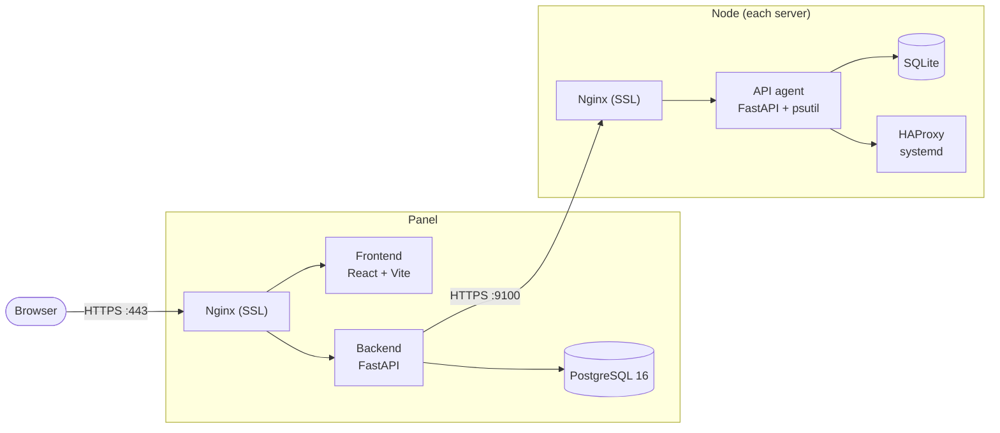

<div align="center">


# Monitoring

**Server management panel: real-time monitoring, HAProxy, firewall, anti-DDoS, Remnawave and Telegram alerts — all in one web interface.**

[](#)
[](#license)
[](#)
[](#)
[](#)
[](https://t.me/+IClul20AJ7Y5MTFi)

[Русский](README.md) | **English**

[Features](#features) · [Screenshots](#screenshots) · [Installation](#installation) · [Architecture](#architecture) · [FAQ](#faq) · [What's new](#whats-new)

</div>

---

## Installation

One command on a clean Ubuntu 20.04+ / Debian 11+:

```bash
bash <(curl -fsSL https://raw.githubusercontent.com/Joliz1337/monitoring/main/install.sh)
```

After installation the `mon` command is available — an interactive manager:

```
1) Install panel              5) Remove panel
2) Install node               6) Remove node
3) Update panel               7) System optimizations
4) Update node                0) Exit
```

**Panel** — the script installs Docker, asks for a domain, obtains a Let's Encrypt SSL certificate, generates `.env` and starts the containers. At the end it prints `https://{domain}/{uid}` and the login password.

**Node** — installs Docker, HAProxy (native systemd), ipset and UFW. Asks you to paste `NODE_SECRET` — the shared install token from the **Servers** page of the panel (the same one for all nodes, copy it once). The token embeds the mTLS certificates and the panel IP — port 9100 opens for the panel only. After the install just add the server in the panel: name + IP.

<details>
<summary><b>One-command node install (unattended)</b></summary>

<br>

`NODE_SECRET` is the shared install token from the **Servers** page of the panel: the same one for all nodes — copy it once and reuse it. The panel IP is embedded in the token itself — no need to pass it separately.

```bash
# Node only
bash <(curl -fsSL https://raw.githubusercontent.com/Joliz1337/monitoring/main/install.sh) <NODE_SECRET>

# Node + system optimizations (NIC mode auto-detected)
bash <(curl -fsSL https://raw.githubusercontent.com/Joliz1337/monitoring/main/install.sh) <NODE_SECRET> --optimize

# Node + optimizations with an explicit sysctl profile
bash <(curl -fsSL https://raw.githubusercontent.com/Joliz1337/monitoring/main/install.sh) <NODE_SECRET> --optimize --profile=vpn
```

If the command is run inside the Hetzner Rescue System, the installer provisions Ubuntu 24.04 on disk, reboots the server and automatically installs the node with the same parameters after first boot.

</details>

## Features

### Monitoring

| Module | Description |
|--------|-------------|
| **Dashboard** | Server cards with drag-and-drop, statuses, SSL, key metrics |
| **Server metrics** | CPU, RAM, disks, network, TCP states, processes — in real time |
| **Charts** | 1h / 24h / 7d / 30d / 365d with automatic aggregation |
| **Traffic** | Per interface, port, TCP/UDP connection |
| **Terminal** | Run commands on nodes right from the browser |

### Management

| Module | Description |
|--------|-------------|
| **HAProxy** | Rules, start/stop/reload, logs, config editor on every node |
| **HAProxy configs** | Centralized configuration profiles with mass rollout to servers |
| **Firewall profiles** | UFW rule templates: one click — identical firewall across a server group |
| **Remnawave nginx** | Nginx config profiles for Remnawave nodes with real-IP forwarding setup |
| **Wildcard SSL** | Wildcard certificate issuance (Cloudflare DNS), auto-renewal, deployment to nodes |
| **Bulk actions** | One operation across multiple servers at once |
| **Optimizations** | Kernel, network and NIC tuning on nodes — values computed for the actual hardware |
| **Updates** | Update the panel and all nodes from the web interface |

### Protection

| Module | Description |
|--------|-------------|
| **Anti-DDoS** | Emergency mode (SYNPROXY, hashlimit), attack auto-detection, whitelist |
| **IP Blocklist** | ipset in/out lists, auto-updated sources, global and per-server rules |
| **Torrent blocker** | Automatic IP blocking from Remnawave torrent detector reports |
| **SSH security** | sshd settings, fail2ban and SSH keys with presets and bulk apply |

### Services

| Module | Description |
|--------|-------------|
| **Remnawave** | User statistics via the Remnawave Panel API: IPs, ASN grouping, HWID devices, anomaly analyzer |
| **Alerts** | Telegram notifications: offline, CPU, RAM, network, TCP states, conntrack — with cooldown |
| **Billing** | Server and project payment tracking: due dates, costs, reminders |
| **Notes & tasks** | Shared notepad and task list with real-time sync |

## Screenshots

> Click a row to expand the screenshot. Images are clickable — they open in full size.

<details>
<summary><b>Dashboard</b> — all servers on one screen: statuses, metrics, SSL</summary>


</details>

<details>
<summary><b>Server page</b> — real-time metrics and charts: CPU, RAM, disks, network, processes</summary>


</details>

<details>
<summary><b>Traffic</b> — breakdown by interface, port and connection</summary>


</details>

<details>
<summary><b>HAProxy</b> — proxy rules, service control and config editor</summary>


</details>

<details>
<summary><b>IP Blocklist</b> — block lists with auto-updated sources</summary>


</details>

<details>
<summary><b>Remnawave</b> — user statistics and anomaly analyzer</summary>


</details>

<details>
<summary><b>Anti-DDoS</b> — node protection status, attack auto-detection and emergency mode</summary>


</details>

<details>
<summary><b>Alerts</b> — fine-grained Telegram notification settings per trigger</summary>


</details>

## Architecture



**Panel** — React + FastAPI + PostgreSQL 16, Docker images from GHCR. Collects metrics from all nodes, stores history, sends alerts.
**Node** — a lightweight FastAPI agent on every server. Stores data locally in SQLite; HAProxy runs as a native systemd service.

## Updating

**Via the web interface** — the **Updates** section in the panel menu: updates both the panel and all nodes.

**Via CLI:**

```bash
mon   # menu items 3 and 4
```

**Via the script directly:**

```bash
cd /opt/monitoring-panel && ./update.sh   # panel
cd /opt/monitoring-node && ./update.sh    # node
```

The `.env` configuration is preserved on update. Images are pulled from GHCR with a fallback to local build.

**Update channels** (Settings → Update channel): **Stable** (`main`) — tested releases, **Dev** (`dev`) — active development.

<details>
<summary><b>System requirements</b></summary>

### OS and software

- **OS**: Ubuntu 20.04+ / Debian 11+ (amd64)
- **Docker**: 20.10+ (installed automatically)

### Panel

| Servers | Modules | Minimum | Recommended |
|---------|---------|---------|-------------|
| 1–5 | Monitoring, alerts | 1 vCPU / 512 MB / 5 GB | 1 vCPU / 1 GB / 10 GB |
| 5–15 | + Remnawave, Blocklist | 1 vCPU / 1 GB / 10 GB | 2 vCPU / 1 GB / 20 GB |
| 15–30 | All modules | 2 vCPU / 1 GB / 20 GB | 4 vCPU / 1 GB / 40 GB |
| 30–200+ | All + long retention | 4 vCPU / 1 GB / 40 GB | 4–6 vCPU / 2 GB / 60+ GB |

The panel is designed with headroom for 500+ nodes: PostgreSQL connection pooling, semaphore-bounded parallel node requests, hard polling timeouts. The confirmed working scale is 180+ servers on a single panel.

**CPU** — the main load: PostgreSQL queries, polling all nodes every 10 seconds.
**Disk** — 365-day retention with 30+ servers can take 15–30 GB. SSD is mandatory.

### Node

The node adds minimal overhead to an existing server.

| Scenario | RAM | CPU |
|----------|-----|-----|
| Basic (monitoring + HAProxy + firewall + traffic) | ~100–150 MB | < 1% |
| + Torrent blocker | +50 MB | < 1% |

</details>

<details>
<summary><b>Configuration (.env)</b></summary>

### Panel

| Parameter | Description | Default |
|-----------|-------------|---------|
| `DOMAIN` | Panel domain | set during install |
| `PANEL_UID` | Secret path `domain.com/{uid}` | auto |
| `PANEL_PASSWORD` | Login password | auto |
| `JWT_SECRET` | JWT secret | auto |
| `JWT_EXPIRE_MINUTES` | Token lifetime | 1440 |
| `MAX_FAILED_ATTEMPTS` | Attempts before ban | 5 |
| `BAN_DURATION_SECONDS` | Ban duration (sec) | 900 |
| `POSTGRES_USER` | PostgreSQL user | panel |
| `POSTGRES_PASSWORD` | PostgreSQL password | auto |
| `POSTGRES_DB` | Database name | panel |

### Node

| Parameter | Description | Default |
|-----------|-------------|---------|
| `NODE_NAME` | Node name | server hostname |
| `TRAFFIC_COLLECT_INTERVAL` | Traffic collection interval (sec) | 60 |
| `TRAFFIC_RETENTION_DAYS` | Traffic data retention (days) | 90 |

Panel ↔ node authorization uses mTLS certificates unpacked from `NODE_SECRET` during install. There is no separate API key in `.env`.

</details>

<details>
<summary><b>Security</b></summary>

### Panel

- Secret URL: `domain.com/{PANEL_UID}` — every other path gets a connection drop (nginx 444)
- Double UID check: nginx + API (timing-safe)
- JWT in an httpOnly cookie (secure, samesite=strict)
- Anti-brute force: 5 attempts → 15-minute ban
- Rate limiting: 60 req/min for unauthorized clients
- TLS 1.2/1.3
- Connection drop on any authorization error — no HTTP response

### Node

- mTLS: the node's nginx only accepts requests with a valid panel client certificate (shared `NODE_SECRET`)
- Port 9100 open to the panel IP only (UFW)
- Rate limiting: 100 req/min
- Anti-brute force: 10 attempts → 1-hour ban
- Connection drop without an HTTP response

### Ports

| Port | Component | Access |
|------|-----------|--------|
| 443 | Panel | Everyone |
| 80 | Panel / Node | Everyone (Let's Encrypt) |
| 9100 | Node | Panel IP only |
| 22 | Node | Everyone (SSH) |

</details>

<details>
<summary><b>System optimizations</b></summary>

Applied manually: `mon` → item 7, or from the panel (**Optimizations** section). Nothing is changed automatically.

- **Values are computed for the actual hardware** — the renderer reads RAM, CPU count, MTU and link speed, then recalculates conntrack, network buffers, descriptor limits and HAProxy `maxconn`. The same profile is correct on 4 GB and on 248 GB of RAM.
- **Three NIC modes** with auto-detection: hardware multiqueue, hybrid, software RPS/RFS.
- **Recalculated on every boot** — after a VPS resize the values pick themselves up.
- Include BBR + fq_codel, tuned TCP/UDP buffers, anti-DDoS kernel settings (syncookies, rp_filter).
- Any value can be overridden in `/opt/monitoring/configs/local-overrides.conf`; `rollback` restores the previous config.

</details>

<details>
<summary><b>Management (CLI)</b></summary>

```bash
mon                             # Install/update manager

# Panel (/opt/monitoring-panel)
docker compose logs -f          # Logs
docker compose restart          # Restart
docker compose down             # Stop
certbot certificates            # SSL status

# Node (/opt/monitoring-node)
docker compose logs -f          # API logs
docker compose restart          # Restart API
systemctl status haproxy        # HAProxy status
systemctl reload haproxy        # Reload HAProxy config
journalctl -u haproxy -n 100    # HAProxy logs
```

</details>

<details>
<summary><b>Project structure</b></summary>

```
monitoring/
├── install.sh              # Installer + CLI (mon)
├── panel/                  # Web panel
│   ├── frontend/           # React + Vite + Tailwind
│   ├── backend/            # FastAPI + PostgreSQL 16
│   ├── nginx/              # Reverse proxy + SSL
│   └── DOCUMENTATION.md
├── node/                   # Monitoring agent
│   ├── app/                # FastAPI + psutil
│   ├── nginx/              # Reverse proxy + SSL
│   └── DOCUMENTATION.md
├── configs/                # Optimizations: sysctl renderer, NIC tuning, anti-DDoS watchdog
└── scripts/                # Helper CLI scripts
```

</details>

## FAQ

<details>
<summary><b>Forgot the panel address or password — how do I log in?</b></summary>

<br>

Everything is in `.env` on the panel server:

```bash
cat /opt/monitoring-panel/.env | grep -E "DOMAIN|PANEL_UID|PANEL_PASSWORD"
```

The panel address is `https://{DOMAIN}/{PANEL_UID}`, the password is `PANEL_PASSWORD`.

</details>

<details>
<summary><b>How do I add a server to the panel?</b></summary>

<br>

Copy the shared `NODE_SECRET` from the **Servers** page of the panel (it is the same for all nodes) and install the node in any of these ways:

- the one-liner with `NODE_SECRET` — see the Installation section;
- `mon` → item 2 — the script asks you to paste the same `NODE_SECRET`;
- SSH auto-deploy right from the **Servers → Add server** form — the panel connects to the server and installs everything itself.

After the install add the server in the panel (name + IP). Authorization uses the mTLS certificates from the token — no keys need to be entered manually.

</details>

<details>
<summary><b>The node shows offline — what should I check?</b></summary>

<br>

1. The node container is alive: `cd /opt/monitoring-node && docker compose ps` and `docker compose logs -f`.
2. Port 9100 is open for the panel IP: `ufw status | grep 9100`. If the panel IP changed — see the next question.
3. The port is reachable from the panel server: `curl -vk https://NODE_IP:9100` — the connection should be established; a client-certificate error in the response is normal (mTLS) and confirms the node's nginx is alive.

</details>

<details>
<summary><b>The panel IP changed — nodes went offline. What now?</b></summary>

<br>

On every node port 9100 is open only for the old panel IP. Update the UFW rule:

```bash
ufw delete allow from OLD_IP to any port 9100 proto tcp
ufw allow from NEW_IP to any port 9100 proto tcp
```

</details>

<details>
<summary><b>Which ports need to be open?</b></summary>

<br>

Panel: **443** (web interface) and **80** (Let's Encrypt renewal). Node: **9100** — for the panel IP only (UFW is configured by the installer automatically), **80** — for SSL issuance. Nothing else is exposed.

</details>

<details>
<summary><b>What's the difference between the Stable and Dev channels?</b></summary>

<br>

**Stable** (`main`) — tested releases, recommended for everyone. **Dev** (`dev`) — active development: new features arrive earlier, but rough edges are possible. The channel is switched in the panel: Settings → Update channel; it affects updates of the panel, nodes and configs.

</details>

<details>
<summary><b>Do I have to apply the system optimizations?</b></summary>

<br>

No, it's an optional step — the panel and node work fine without them. Optimizations make sense on loaded nodes (VPN, proxies, lots of connections): they tune conntrack, network buffers and limits for the actual hardware. Applied via `mon` → item 7 or from the panel; any value can be overridden or rolled back.

</details>

<details>
<summary><b>What does the Remnawave integration give me?</b></summary>

<br>

The panel connects to your Remnawave panel's API and shows, per user, connection IP addresses grouped by ASN and HWID devices. The anomaly analyzer highlights suspicious behavior: device limit exceeded by IP/ASN, unknown clients by User-Agent, traffic spikes. Check thresholds and the known-client registry are configurable in the panel.

</details>

<details>
<summary><b>Will an update wipe my settings?</b></summary>

<br>

No. `.env` is preserved and the database lives in a Docker volume untouched by updates. Only the code and container images are updated.

</details>

<details>
<summary><b>How do I remove the panel or a node?</b></summary>

<br>

`mon` → item 5 (panel) or 6 (node). The script stops and removes the component's containers and files.

</details>

## What's new

A plain-language change history is in [CHANGES.md](CHANGES.md): what changed, what it gives you and whether you need to do anything after updating.

Ask questions, chat and follow update announcements in the [Telegram community](https://t.me/+IClul20AJ7Y5MTFi). Ideas and bug reports are also welcome in [Issues](https://github.com/Joliz1337/monitoring/issues).

## Documentation

- [Panel](panel/DOCUMENTATION.md) — API, DB, Remnawave, Blocklist, alerts
- [Node](node/DOCUMENTATION.md) — API, metrics, HAProxy, traffic, ipset, optimizations, anti-DDoS

## License

[MIT](https://opensource.org/licenses/MIT)
