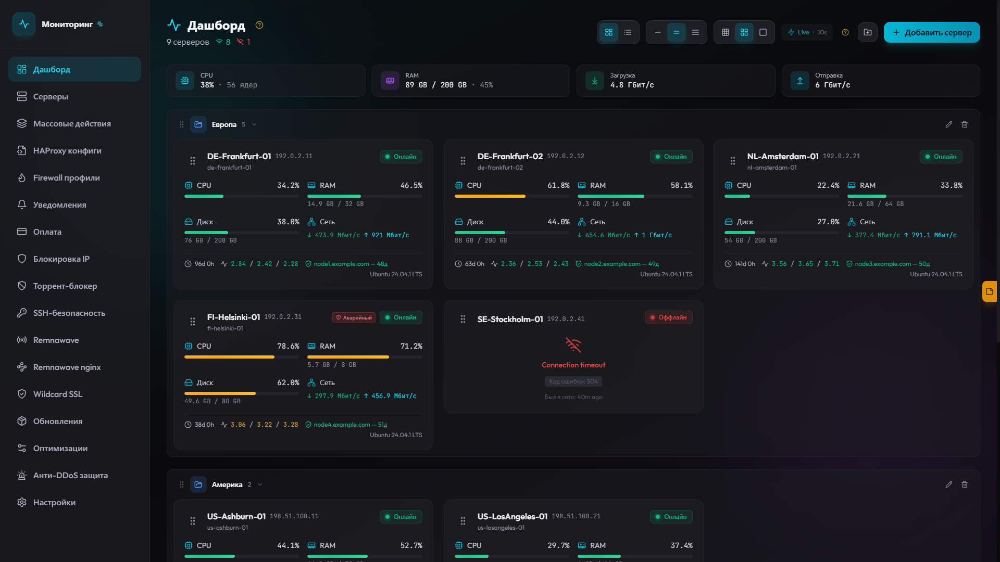
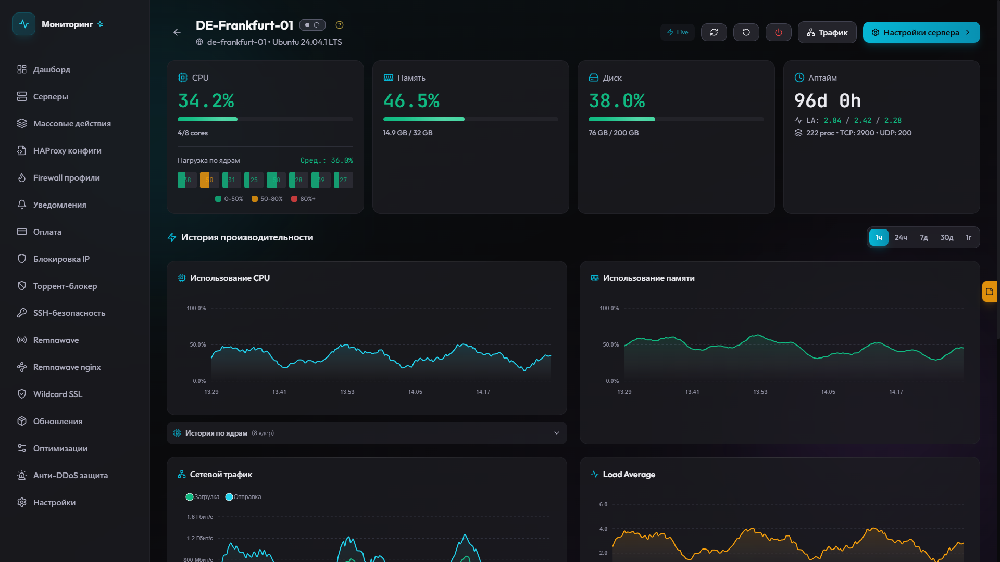
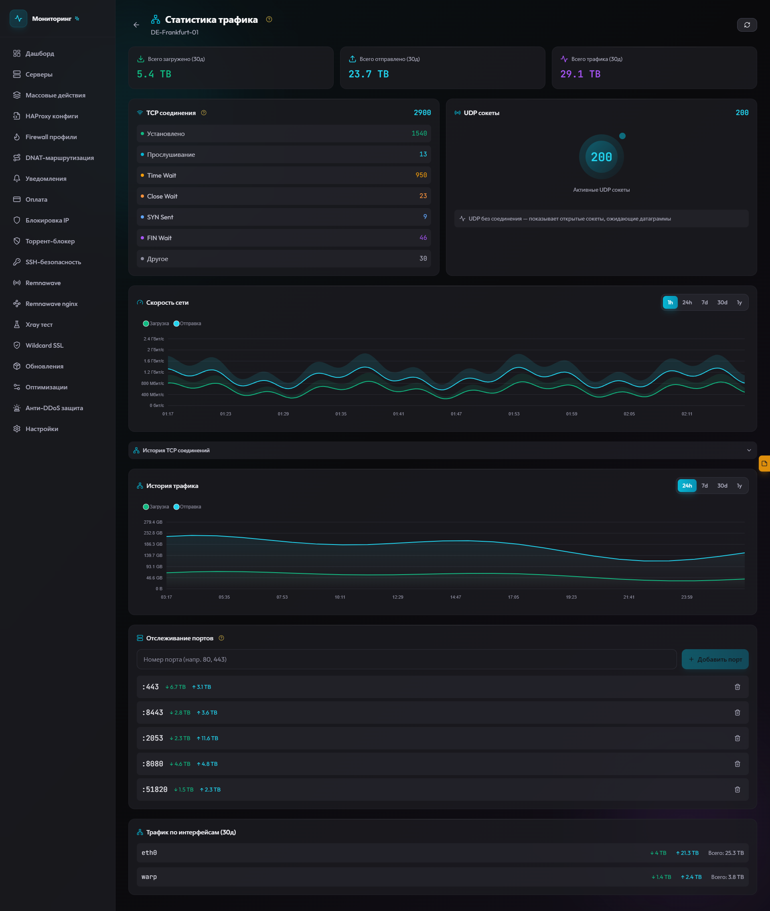
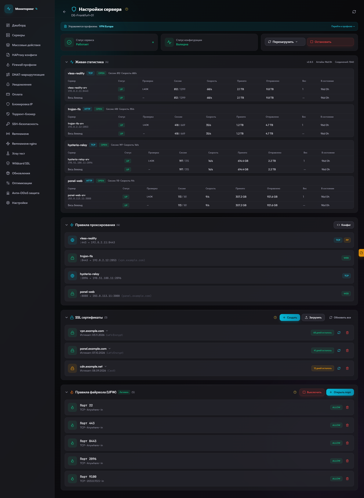
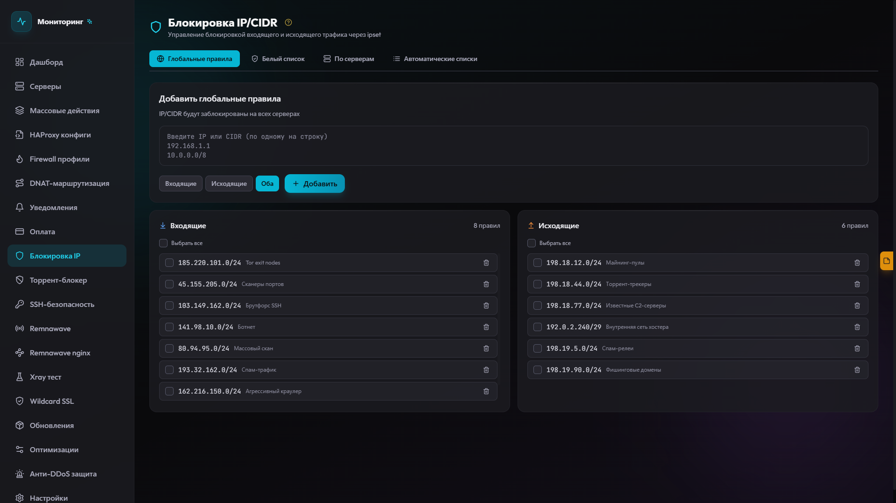
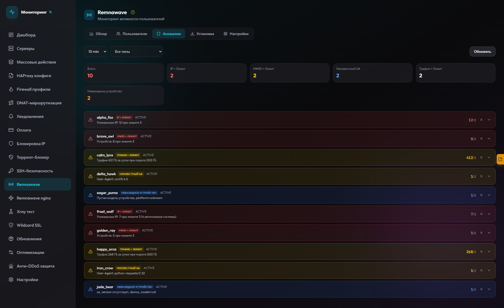
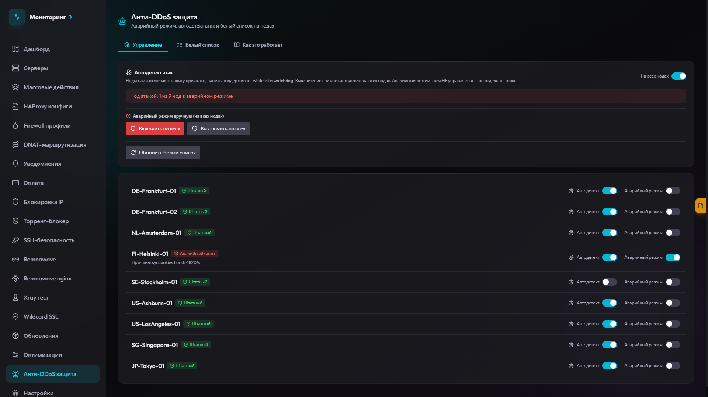
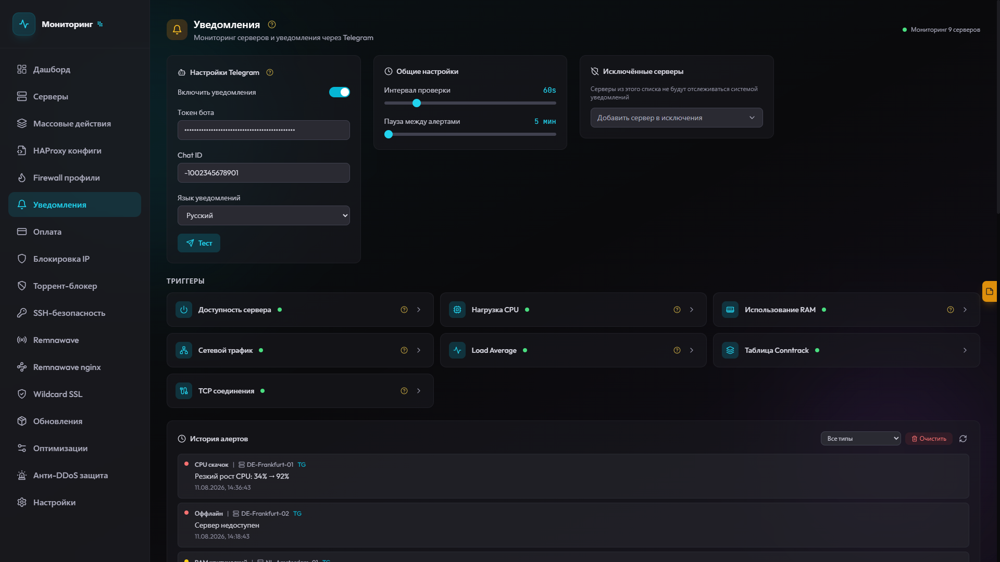
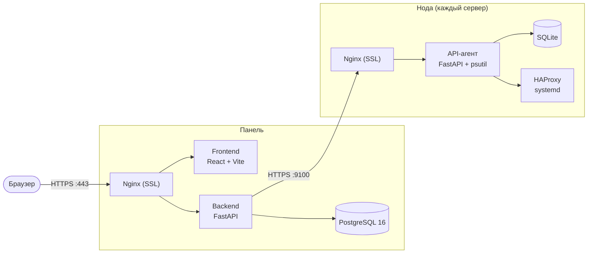

<div align="center">


# Monitoring

**Панель управления серверами: real-time мониторинг, HAProxy, firewall, анти-DDoS, Remnawave и Telegram-алерты — всё в одном веб-интерфейсе.**

[](#)
[](#license)
[](#)
[](#)
[](#)
[](https://t.me/+IClul20AJ7Y5MTFi)

**Русский** | [English](README.en.md)

[Возможности](#возможности) · [Скриншоты](#скриншоты) · [Установка](#установка) · [Архитектура](#архитектура) · [FAQ](#faq) · [Что нового](#что-нового)

</div>

---

## Установка

Одна команда на чистом Ubuntu 20.04+ / Debian 11+:

```bash
bash <(curl -fsSL https://raw.githubusercontent.com/Joliz1337/monitoring/main/install.sh)
```

После установки доступна команда `mon` — интерактивный менеджер:

```
1) Установить панель          5) Удалить панель
2) Установить ноду            6) Удалить ноду
3) Обновить панель            7) Системные оптимизации
4) Обновить ноду              0) Выход
```

**Панель** — скрипт установит Docker, запросит домен, получит SSL-сертификат Let's Encrypt, сгенерирует `.env` и запустит контейнеры. В конце покажет адрес `https://{домен}/{uid}` и пароль для входа.

**Нода** — установит Docker, HAProxy (native systemd), ipset и UFW. Попросит вставить `NODE_SECRET` — общий установочный токен со страницы **Серверы** в панели (один и тот же для всех нод, копируется один раз). В токене зашиты mTLS-сертификаты и IP панели — порт 9100 откроется только для неё. После установки просто добавьте сервер в панели: имя + IP.

<details>
<summary><b>Установка ноды одной командой (без вопросов)</b></summary>

<br>

`NODE_SECRET` — общий установочный токен со страницы **Серверы** в панели: один и тот же для всех нод, скопируйте один раз и переиспользуйте. IP панели зашит в сам токен — отдельно указывать не нужно.

```bash
# Только нода
bash <(curl -fsSL https://raw.githubusercontent.com/Joliz1337/monitoring/main/install.sh) <NODE_SECRET>

# Нода + системные оптимизации (режим NIC определяется автоматически)
bash <(curl -fsSL https://raw.githubusercontent.com/Joliz1337/monitoring/main/install.sh) <NODE_SECRET> --optimize

# Нода + оптимизации с явным профилем sysctl
bash <(curl -fsSL https://raw.githubusercontent.com/Joliz1337/monitoring/main/install.sh) <NODE_SECRET> --optimize --profile=vpn
```

Если команда запущена в Hetzner Rescue System — установщик сам поставит Ubuntu 24.04 на диск, перезагрузит сервер и после первого старта автоматически установит ноду с теми же параметрами.

</details>

## Возможности

### Мониторинг

| Модуль | Описание |
|--------|----------|
| **Dashboard** | Карточки серверов с drag-and-drop, статусы, SSL, ключевые метрики |
| **Метрики сервера** | CPU, RAM, диски, сеть, TCP states, процессы — в реальном времени |
| **Графики** | 1ч / 24ч / 7д / 30д / 365д с автоагрегацией |
| **Трафик** | По интерфейсам, портам, TCP/UDP-соединениям |
| **Терминал** | Выполнение команд на нодах прямо из браузера |

### Управление

| Модуль | Описание |
|--------|----------|
| **HAProxy** | Правила, старт/стоп/reload, логи, редактор конфига на каждой ноде |
| **HAProxy конфиги** | Централизованные профили конфигурации с массовой раскаткой на серверы |
| **Firewall профили** | Шаблоны UFW-правил: один клик — одинаковый firewall на группе серверов |
| **Remnawave nginx** | Профили nginx-конфигов Remnawave-нод с настройкой передачи реального IP |
| **Wildcard SSL** | Выпуск wildcard-сертификатов (Cloudflare DNS), автопродление, деплой на ноды |
| **Массовые действия** | Одна операция сразу на нескольких серверах |
| **Оптимизации** | Тюнинг ядра, сети и NIC на нодах — значения рассчитываются под железо |
| **Обновления** | Обновление панели и всех нод из веб-интерфейса |

### Защита

| Модуль | Описание |
|--------|----------|
| **Анти-DDoS** | Аварийный режим (SYNPROXY, hashlimit), автодетект атак, белый список |
| **IP Blocklist** | ipset-списки in/out, автообновляемые источники, глобальные и per-server правила |
| **Торрент-блокер** | Автоблокировка IP по отчётам торрент-детектора Remnawave |
| **SSH-безопасность** | Настройки sshd, fail2ban и SSH-ключи с пресетами и массовым применением |

### Сервис

| Модуль | Описание |
|--------|----------|
| **Remnawave** | Статистика пользователей через Remnawave Panel API: IP, ASN-группировка, HWID-устройства, анализатор аномалий |
| **Алерты** | Telegram-уведомления: offline, CPU, RAM, сеть, TCP states, conntrack — с cooldown |
| **Оплата** | Учёт оплат серверов и проектов: сроки, стоимость, напоминания |
| **Заметки и задачи** | Общий блокнот и список задач с синхронизацией в реальном времени |

## Скриншоты

> Скриншоты кликабельны — открываются в полном размере.

### Dashboard

Все серверы на одном экране: статусы, метрики, SSL.



### Страница сервера

Метрики и графики в реальном времени: CPU, RAM, диски, сеть, процессы.



### Трафик

Разбивка по интерфейсам, портам и соединениям.



### HAProxy

Правила проксирования, управление сервисом и редактор конфига.



### IP Blocklist

Списки блокировок с автообновляемыми источниками.



### Remnawave

Статистика пользователей и анализатор аномалий.



### Анти-DDoS

Состояние защиты нод, автодетект атак и аварийный режим.



### Алерты

Гибкая настройка Telegram-уведомлений по каждому триггеру.



## Архитектура



**Панель** — React + FastAPI + PostgreSQL 16, Docker-образы из GHCR. Собирает метрики со всех нод, хранит историю, отправляет алерты.
**Нода** — лёгкий FastAPI-агент на каждом сервере. Данные хранит локально в SQLite, HAProxy работает как нативный systemd-сервис.

## Обновление

**Через веб-интерфейс** — раздел **Обновления** в меню панели: обновляет и панель, и все ноды.

**Через CLI:**

```bash
mon   # пункты 3 и 4 в меню
```

**Через скрипт напрямую:**

```bash
cd /opt/monitoring-panel && ./update.sh   # панель
cd /opt/monitoring-node && ./update.sh    # нода
```

Конфигурация `.env` при обновлении сохраняется. Образы скачиваются из GHCR, при недоступности — fallback на локальную сборку.

**Каналы обновлений** (Настройки → Канал обновлений): **Стабильный** (`main`) — проверенные релизы, **Dev** (`dev`) — активная разработка.

<details>
<summary><b>Системные требования</b></summary>

### ОС и софт

- **OS**: Ubuntu 20.04+ / Debian 11+ (amd64)
- **Docker**: 20.10+ (устанавливается автоматически)

### Панель

| Серверов | Модули | Минимум | Рекомендуемые |
|----------|--------|---------|---------------|
| 1–5 | Мониторинг, алерты | 1 vCPU / 512 MB / 5 GB | 1 vCPU / 1 GB / 10 GB |
| 5–15 | + Remnawave, Blocklist | 1 vCPU / 1 GB / 10 GB | 2 vCPU / 1 GB / 20 GB |
| 15–30 | Все модули | 2 vCPU / 1 GB / 20 GB | 4 vCPU / 1 GB / 40 GB |
| 30–200+ | Все + длительное хранение | 4 vCPU / 1 GB / 40 GB | 4–6 vCPU / 2 GB / 60+ GB |

Панель проектировалась с запасом под 500+ нод: пул соединений PostgreSQL, ограничение параллельных запросов к нодам семафорами, жёсткие таймауты опроса. Подтверждённый рабочий масштаб — 180+ серверов на одной панели.

**CPU** — основная нагрузка: запросы к PostgreSQL, параллельный опрос нод каждые 10 сек.
**Диск** — retention 365 дней на 30+ серверах может занять 15–30 GB. SSD обязателен.

### Нода

Нода добавляет минимальный overhead к существующему серверу.

| Сценарий | RAM | CPU |
|----------|-----|-----|
| Базовый (мониторинг + HAProxy + firewall + трафик) | ~100–150 MB | < 1% |
| + Торрент-блокер | +50 MB | < 1% |

</details>

<details>
<summary><b>Конфигурация (.env)</b></summary>

### Панель

| Параметр | Описание | Default |
|----------|----------|---------|
| `DOMAIN` | Домен панели | задаётся при установке |
| `PANEL_UID` | Секретный путь `domain.com/{uid}` | auto |
| `PANEL_PASSWORD` | Пароль для входа | auto |
| `JWT_SECRET` | Секрет для JWT | auto |
| `JWT_EXPIRE_MINUTES` | Время жизни токена | 1440 |
| `MAX_FAILED_ATTEMPTS` | Попыток до бана | 5 |
| `BAN_DURATION_SECONDS` | Время бана (сек) | 900 |
| `POSTGRES_USER` | Пользователь PostgreSQL | panel |
| `POSTGRES_PASSWORD` | Пароль PostgreSQL | auto |
| `POSTGRES_DB` | Имя базы | panel |

### Нода

| Параметр | Описание | Default |
|----------|----------|---------|
| `NODE_NAME` | Имя ноды | hostname сервера |
| `TRAFFIC_COLLECT_INTERVAL` | Интервал сбора трафика (сек) | 60 |
| `TRAFFIC_RETENTION_DAYS` | Хранение данных трафика (дни) | 90 |

Авторизация панель ↔ нода — mTLS-сертификаты, распакованные из `NODE_SECRET` при установке. Отдельного API-ключа в `.env` нет.

</details>

<details>
<summary><b>Безопасность</b></summary>

### Панель

- Секретный URL: `domain.com/{PANEL_UID}` — все остальные пути получают connection drop (nginx 444)
- Двойная проверка UID: nginx + API (timing-safe)
- JWT в httpOnly cookie (secure, samesite=strict)
- Anti-brute force: 5 попыток → бан на 15 минут
- Rate limiting: 60 req/min для неавторизованных
- TLS 1.2/1.3
- Connection drop при любых ошибках авторизации — без HTTP-ответа

### Нода

- mTLS: nginx ноды принимает запросы только с валидным клиентским сертификатом панели (общий `NODE_SECRET`)
- Порт 9100 открыт только для IP панели (UFW)
- Rate limiting: 100 req/min
- Anti-brute force: 10 попыток → бан на 1 час
- Connection drop без HTTP-ответа

### Порты

| Порт | Компонент | Доступ |
|------|-----------|--------|
| 443 | Панель | Все |
| 80 | Панель / Нода | Все (Let's Encrypt) |
| 9100 | Нода | Только IP панели |
| 22 | Нода | Все (SSH) |

</details>

<details>
<summary><b>Системные оптимизации</b></summary>

Применяются вручную: `mon` → пункт 7, либо из панели (раздел **Оптимизации**). Автоматически ничего не меняется.

- **Значения рассчитываются под конкретное железо** — рендерер читает RAM, число CPU, MTU и скорость линка и пересчитывает conntrack, сетевые буферы, лимиты дескрипторов и `maxconn` HAProxy. Один и тот же профиль корректен и на 4 GB, и на 248 GB RAM.
- **Три режима NIC** с автоопределением: аппаратный multiqueue, гибридный, программный RPS/RFS.
- **Пересчёт при каждой загрузке** — после ресайза VPS значения подхватываются сами.
- Включают BBR + fq_codel, оптимизированные TCP/UDP-буферы, anti-DDoS-настройки ядра (syncookies, rp_filter).
- Любое значение можно переопределить в `/opt/monitoring/configs/local-overrides.conf`, есть `rollback` для отката.

</details>

<details>
<summary><b>Управление (CLI)</b></summary>

```bash
mon                             # Менеджер установки/обновления

# Панель (/opt/monitoring-panel)
docker compose logs -f          # Логи
docker compose restart          # Перезапуск
docker compose down             # Остановка
certbot certificates            # Статус SSL

# Нода (/opt/monitoring-node)
docker compose logs -f          # Логи API
docker compose restart          # Перезапуск API
systemctl status haproxy        # Статус HAProxy
systemctl reload haproxy        # Reload конфига HAProxy
journalctl -u haproxy -n 100    # Логи HAProxy
```

</details>

<details>
<summary><b>Структура проекта</b></summary>

```
monitoring/
├── install.sh              # Установщик + CLI (mon)
├── panel/                  # Веб-панель
│   ├── frontend/           # React + Vite + Tailwind
│   ├── backend/            # FastAPI + PostgreSQL 16
│   ├── nginx/              # Reverse proxy + SSL
│   └── DOCUMENTATION.md
├── node/                   # Агент мониторинга
│   ├── app/                # FastAPI + psutil
│   ├── nginx/              # Reverse proxy + SSL
│   └── DOCUMENTATION.md
├── configs/                # Оптимизации: sysctl-рендерер, NIC-тюнинг, анти-DDoS watchdog
└── scripts/                # Вспомогательные скрипты CLI
```

</details>

## FAQ

<details>
<summary><b>Забыл адрес панели или пароль — как войти?</b></summary>

<br>

Всё лежит в `.env` на сервере панели:

```bash
cat /opt/monitoring-panel/.env | grep -E "DOMAIN|PANEL_UID|PANEL_PASSWORD"
```

Адрес панели — `https://{DOMAIN}/{PANEL_UID}`, пароль — `PANEL_PASSWORD`.

</details>

<details>
<summary><b>Как добавить сервер в панель?</b></summary>

<br>

Скопируйте общий `NODE_SECRET` на странице **Серверы** в панели (он один для всех нод) и установите ноду любым из способов:

- one-liner с `NODE_SECRET` — см. раздел «Установка»;
- `mon` → пункт 2 — скрипт попросит вставить тот же `NODE_SECRET`;
- автоустановка по SSH прямо из формы **Серверы → Добавить сервер** — панель сама подключится к серверу и всё установит.

После установки добавьте сервер в панели (имя + IP). Авторизация идёт по mTLS-сертификатам из токена — никакие ключи вручную вводить не нужно.

</details>

<details>
<summary><b>Нода показывает offline — что проверить?</b></summary>

<br>

1. Контейнер ноды жив: `cd /opt/monitoring-node && docker compose ps` и `docker compose logs -f`.
2. Порт 9100 открыт именно для IP панели: `ufw status | grep 9100`. Если IP панели изменился — см. следующий вопрос.
3. С сервера панели порт доступен: `curl -vk https://IP_НОДЫ:9100` — соединение должно устанавливаться; ошибка про клиентский сертификат в ответе — это нормально (mTLS), она подтверждает что nginx ноды жив.

</details>

<details>
<summary><b>IP панели изменился — ноды отвалились. Что делать?</b></summary>

<br>

На каждой ноде порт 9100 открыт только для старого IP панели. Обновите правило UFW:

```bash
ufw delete allow from СТАРЫЙ_IP to any port 9100 proto tcp
ufw allow from НОВЫЙ_IP to any port 9100 proto tcp
```

</details>

<details>
<summary><b>Какие порты должны быть открыты?</b></summary>

<br>

Панель: **443** (веб-интерфейс) и **80** (продление Let's Encrypt). Нода: **9100** — только для IP панели (UFW настраивается установщиком автоматически), **80** — для выпуска SSL. Больше ничего наружу не торчит.

</details>

<details>
<summary><b>Чем отличаются каналы «Стабильный» и «Dev»?</b></summary>

<br>

**Стабильный** (`main`) — проверенные релизы, рекомендуется всем. **Dev** (`dev`) — активная разработка: новые функции появляются раньше, но возможны недоработки. Канал переключается в панели: Настройки → Канал обновлений, влияет на обновления панели, нод и конфигов.

</details>

<details>
<summary><b>Обязательно ли применять системные оптимизации?</b></summary>

<br>

Нет, это опциональный шаг — сами по себе панель и нода работают без них. Оптимизации имеют смысл на нагруженных нодах (VPN, прокси, много соединений): тюнят conntrack, сетевые буферы и лимиты под конкретное железо. Применяются через `mon` → пункт 7 или из панели, любое значение можно переопределить или откатить.

</details>

<details>
<summary><b>Что даёт интеграция с Remnawave?</b></summary>

<br>

Панель подключается к API вашей Remnawave-панели и показывает по каждому пользователю IP-адреса подключений с группировкой по ASN и HWID-устройства. Анализатор аномалий подсвечивает подозрительное поведение: превышение лимита устройств по IP/ASN, неизвестные клиенты по User-Agent, всплески трафика. Пороги проверок и реестр известных клиентов настраиваются в панели.

</details>

<details>
<summary><b>Обновление сотрёт мои настройки?</b></summary>

<br>

Нет. `.env` сохраняется, база данных живёт в Docker volume и обновлением не затрагивается. Обновляется только код и образы контейнеров.

</details>

<details>
<summary><b>Как удалить панель или ноду?</b></summary>

<br>

`mon` → пункт 5 (панель) или 6 (нода). Скрипт остановит и удалит контейнеры и файлы компонента.

</details>

## Что нового

История изменений простым языком — в [CHANGES.md](CHANGES.md): что изменилось, что это даёт и нужно ли что-то делать после обновления.

Задать вопрос, пообщаться и следить за анонсами обновлений можно в [Telegram-сообществе](https://t.me/+IClul20AJ7Y5MTFi). Идеи и баги также welcome в [Issues](https://github.com/Joliz1337/monitoring/issues).

## Документация

- [Панель](panel/DOCUMENTATION.md) — API, БД, Remnawave, Blocklist, алерты
- [Нода](node/DOCUMENTATION.md) — API, метрики, HAProxy, трафик, ipset, оптимизации, анти-DDoS

## License

[MIT](https://opensource.org/licenses/MIT)
