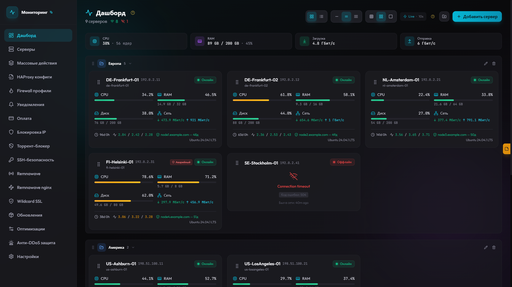
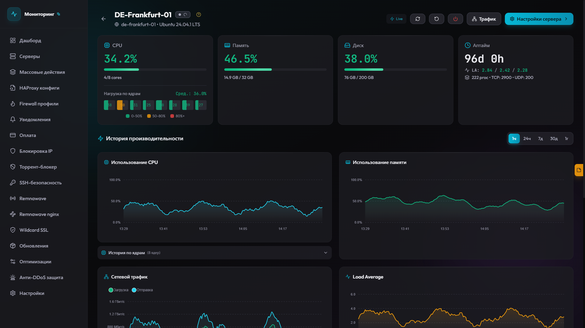
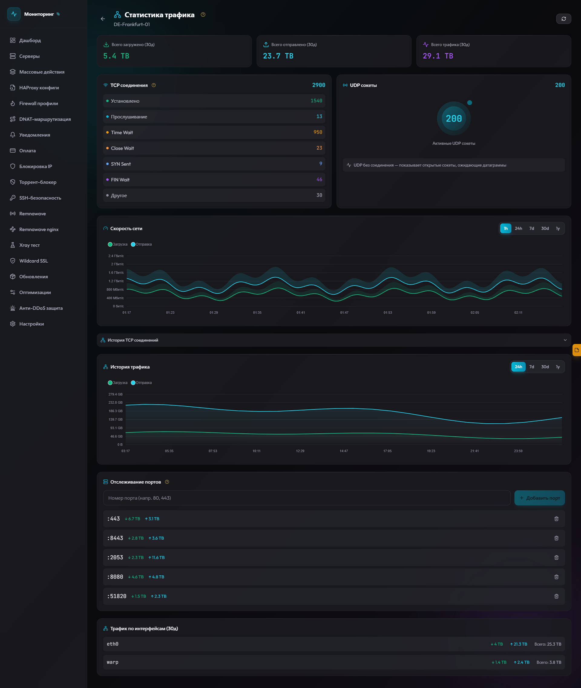
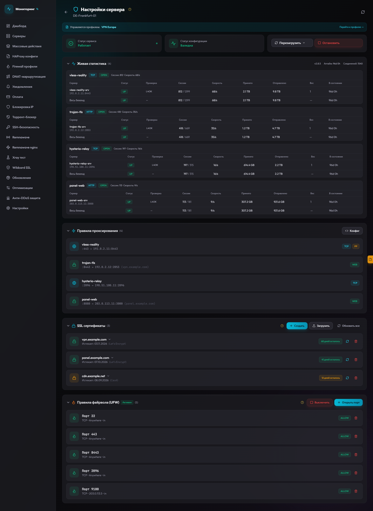
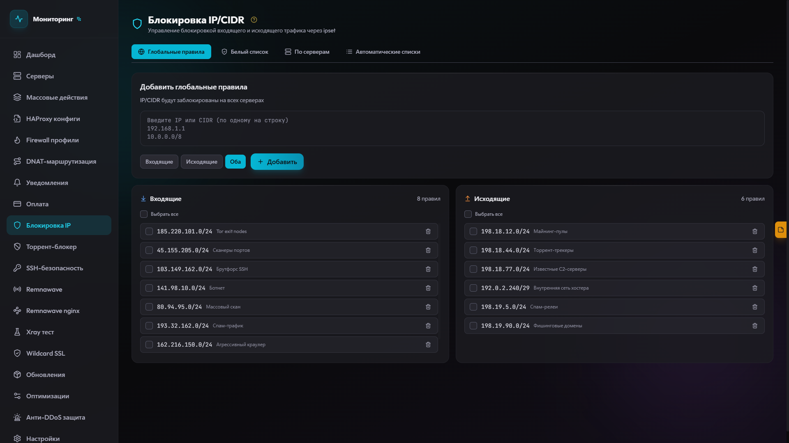
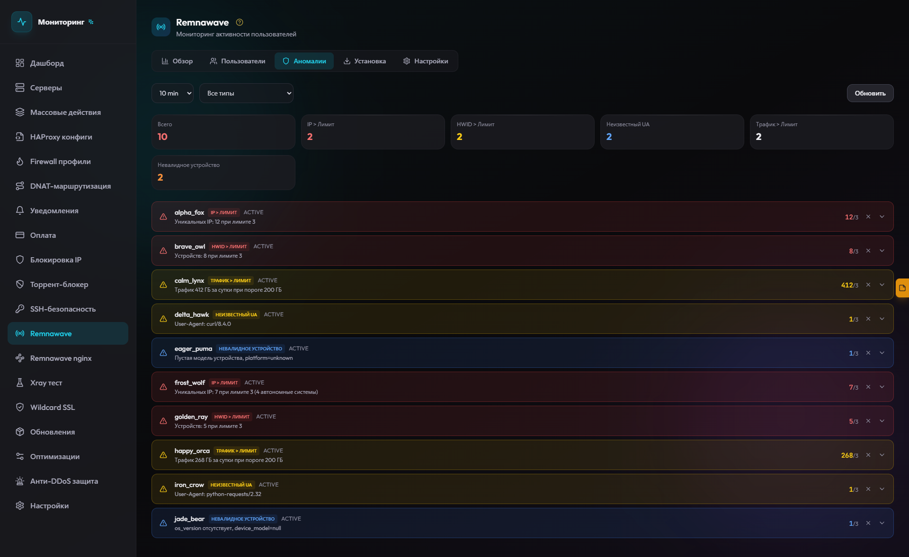
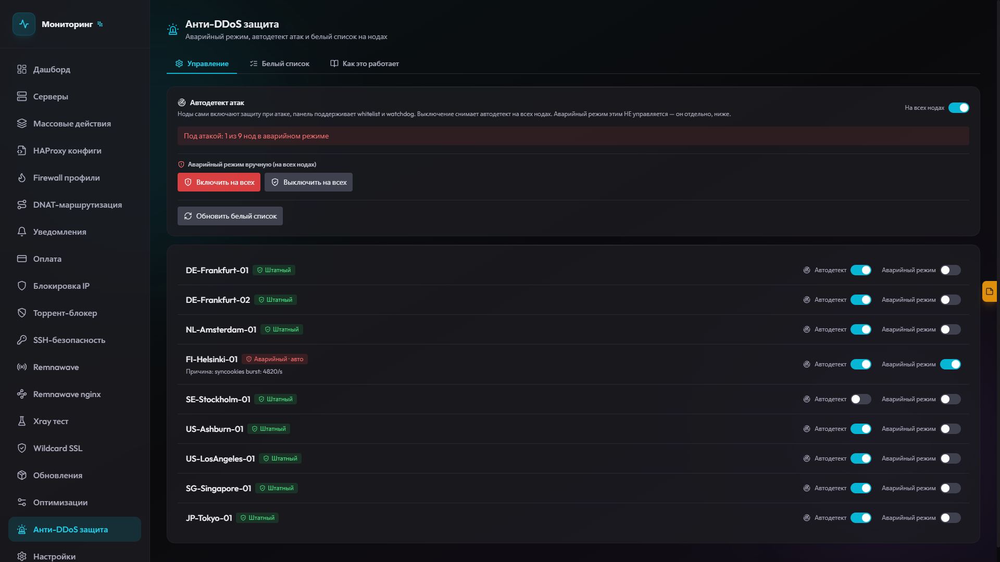
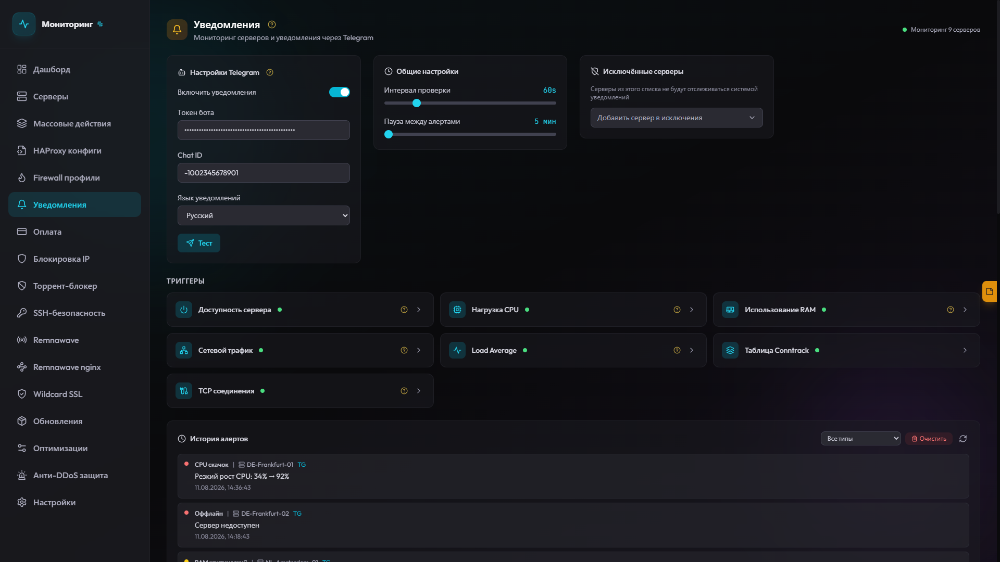
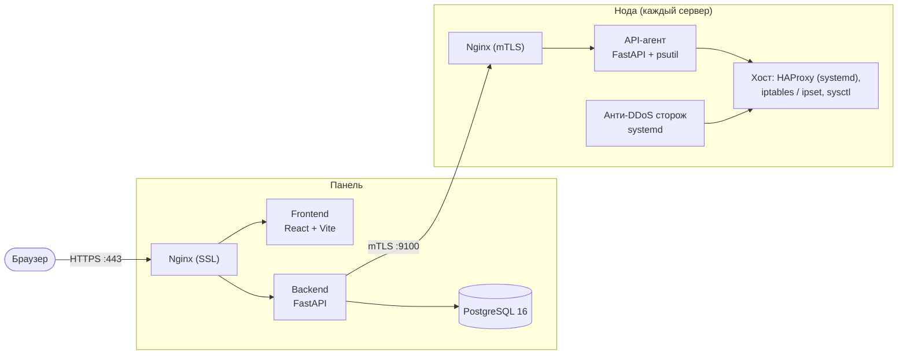

<div align="center">


# Monitoring

**Панель управления парком серверов: мониторинг в реальном времени, HAProxy и DNAT, потери до бэкендов, firewall, анти-DDoS, Remnawave и Telegram-алерты — всё в одном веб-интерфейсе.**

[](#)
[](#license)
[](#)
[](#)
[](#)
[](https://t.me/+IClul20AJ7Y5MTFi)

**Русский** | [English](README.en.md)

[Возможности](#возможности) · [Скриншоты](#скриншоты) · [Установка](#установка) · [Архитектура](#архитектура) · [FAQ](#faq) · [Что нового](#что-нового)

</div>

---

## Установка

Одна команда на чистом Ubuntu 20.04+ / Debian 11+ (рекомендуется Ubuntu 24.04):

```bash
bash <(curl -fsSL https://raw.githubusercontent.com/Joliz1337/monitoring/main/install.sh)
```

После установки доступна команда `mon` — интерактивный менеджер:

```
1) Установить панель          7) Системные оптимизации
2) Установить ноду            8) Настроить прокси
3) Обновить панель            9) Установить ноду Remnawave
4) Обновить ноду              w) Установить Cloudflare WARP
5) Удалить панель             s) Проверка скорости
6) Удалить ноду               0) Выход
```

Пункты 3–6 появляются, когда панель или нода уже стоят на сервере. Пункт 8 задаёт HTTP-прокси, через который установщик качает пакеты, код и Docker-образы. Пункт `s` — Ookla Speedtest или iperf3 до российских серверов. `l` переключает язык меню.

**Панель** — скрипт установит Docker, запросит домен, получит SSL-сертификат Let's Encrypt (по HTTP — если домен уже смотрит на сервер и порт 80 открыт, либо через Cloudflare DNS API по токену — работает за прокси Cloudflare, порт 80 не нужен), сгенерирует `.env` и запустит контейнеры. В конце покажет адрес `https://{домен}/{uid}` и пароль для входа.

**Нода** — установит Docker, HAProxy (свежая официальная LTS-сборка, нативный systemd-сервис), ipset и UFW. Попросит вставить `NODE_SECRET` — общий установочный токен со страницы **Серверы** в панели (один и тот же для всех нод, копируется один раз). В токене зашиты mTLS-сертификаты и IP панели — порт API ноды (9100) откроется только для неё. После установки просто добавьте сервер в панели: имя + IP.

Ноду можно не ставить руками: **Серверы → Добавить сервер** подключится к серверу по SSH и всё установит сама, в том числе на несколько серверов разом.

<details>
<summary><b>Установка ноды одной командой (без вопросов)</b></summary>

<br>

`NODE_SECRET` — общий установочный токен со страницы **Серверы** в панели: один и тот же для всех нод, скопируйте один раз и переиспользуйте. IP панели зашит в сам токен — отдельно указывать не нужно.

```bash
# Только нода
bash <(curl -fsSL https://raw.githubusercontent.com/Joliz1337/monitoring/main/install.sh) <NODE_SECRET>

# Нода + системные оптимизации (режим NIC определяется автоматически)
bash <(curl -fsSL https://raw.githubusercontent.com/Joliz1337/monitoring/main/install.sh) <NODE_SECRET> --optimize

# Нода + оптимизации с явным профилем sysctl
bash <(curl -fsSL https://raw.githubusercontent.com/Joliz1337/monitoring/main/install.sh) <NODE_SECRET> --optimize --profile=vpn

# Нода со своим портом API вместо 9100
bash <(curl -fsSL https://raw.githubusercontent.com/Joliz1337/monitoring/main/install.sh) <NODE_SECRET> --api-port=8443
```

Если команда запущена в Hetzner Rescue System — установщик сам поставит Ubuntu 24.04 на диск, перезагрузит сервер и после первого старта автоматически установит ноду с теми же параметрами.

</details>

## Возможности

### Мониторинг

| Модуль | Описание |
|--------|----------|
| **Dashboard** | Серверы по папкам с drag-and-drop, нагрузка по ядрам, SSL, поиск и фильтр по статусу; сводка по всему парку с графиком за любой период |
| **Страница сервера** | CPU, RAM, диски, сеть, TCP states, процессы — реальные значения за последнюю секунду; история по ядрам тепловой картой, перезагрузка и выключение |
| **Графики** | 1ч / 24ч / 7д / 30д / 365д: средние с полосой пиков, разрывы там, где сервер был недоступен |
| **Трафик** | История по серверу, интерфейсам и портам хранится в панели; запас исходящих портов по каждому направлению |
| **Потери** | Ноды-релеи каждые 2 секунды стучатся на свои бэкенды HAProxy и цели DNAT: таблица потерь по всему парку, проверка адреса с выбранных нод, трасса mtr с владельцами сетей |
| **Терминал** | Команды и многострочные скрипты на нодах прямо из браузера |

### Сеть и проксирование

| Модуль | Описание |
|--------|----------|
| **HAProxy** | Живая статистика, правила, сертификаты, логи и редактор конфига на каждой ноде; обновление до официальной LTS-сборки без обрыва соединений |
| **HAProxy конфиги** | Общие профили с раскаткой на серверы: балансировщик, свои входные и выходные IP у каждого сервера, фильтр SNI, подпись «чей это адрес» у каждого бэкенда |
| **DNAT-маршрутизация** | Проброс портов силами ядра: TCP/UDP, диапазоны, балансировка по нескольким IP, счётчики по правилам — транзит почти без нагрузки на CPU |
| **IP-адреса сервера** | Доп. IPv4/IPv6 списком, диапазоном или подсетью, свой шлюз, снятие лишних адресов хостера; если связь с нодой пропала, изменения откатываются сами |
| **Исходящие адреса** | Исходящий трафик ноды раскладывается по всем её IP — по кругу или вручную; готовый кусок конфига Xray для Remnawave |
| **Exit-прокси** | Локальный SOCKS5 на ноде с пулом выходов: сам проверяет, как Google видит каждый IP (страна, капча, Gemini), и уводит трафик с заблокированного |
| **Лимит полосы** | Ровная полка скорости сервера в Мбит/с, переживает перезагрузку |
| **Remnawave nginx** | Профили nginx перед Remnawave-нодами: правила gRPC и XHTTP, четыре схемы передачи реального IP, один wildcard-домен на все ноды |
| **Wildcard SSL** | Выпуск через Cloudflare DNS, автопродление, раскатка на ноды и на саму панель |

### Защита

| Модуль | Описание |
|--------|----------|
| **Анти-DDoS** | Аварийный режим (SYNPROXY, hashlimit), автодетект атак, белый список; сторож работает на ноде и без панели |
| **IP Blocklist** | ipset-списки in/out, автообновляемые источники, глобальные и per-server правила, «не отвечать на ping» |
| **Firewall профили** | Шаблоны UFW-правил: один клик — одинаковый firewall на группе серверов; панель сверяет правила на нодах и возвращает сбившиеся |
| **Торрент-блокер** | Автоблокировка IP по отчётам торрент-детектора Remnawave |
| **SSH-безопасность** | Настройки sshd, fail2ban и SSH-ключи с пресетами и массовым применением |
| **Доступы хостера** | Находит и вырезает каналы доступа хостера: агент гипервизора, cloud-init, чужие SSH-ключи, лишних пользователей |
| **Права ноды** | Владелец сервера одной строкой в `.env` ноды ограничивает, что панель вправе на нём делать |

### Обслуживание

| Модуль | Описание |
|--------|----------|
| **Автоустановка** | Нода ставится по SSH прямо из панели, сразу на несколько серверов и с привязкой профилей; одноразовые ключи для чужих серверов; Hetzner Rescue |
| **Обновления** | Панель и все ноды из веб-интерфейса: по папкам, в фоне, с этапом на карточке ноды; если нода не обновилась сама, панель обновит её по SSH |
| **Серверы за ТСПУ** | «Качать всё через панель» при установке ноды, Remnawave и обновлении HAProxy; доставка Docker-образа на ноду по SSH; SOCKS5-прокси до ноды |
| **Оптимизации** | Тюнинг ядра, сети и NIC на нодах — значения рассчитываются под железо |
| **Синхронизация времени** | Часовой пояс и NTP на всех серверах и самой панели — с chrony, systemd-timesyncd и ntp |
| **Бэкапы** | Копии базы панели в один клик и автобэкапы в Telegram: шифрование паролем, тома < 50 МБ, восстановление прямо из панели |

### Сервис

| Модуль | Описание |
|--------|----------|
| **Remnawave** | Статистика пользователей через Remnawave Panel API: IP, ASN-группировка, HWID-устройства, анализатор аномалий; установка ноды Remnawave из панели |
| **Xray тест** | Проверка ключей, JSON-конфигов и подписок настоящим ядром Xray / sing-box с панели или с любой ноды; мульти-SNI, экспорт рабочих ключей |
| **Алерты** | Telegram: offline (с причиной, если виноват прокси), CPU, RAM, сеть, TCP states, conntrack, анти-DDoS, потери с релеев, неудачное обновление ноды |
| **Оплата** | Сроки и стоимость серверов; облака Yandex Cloud, Selectel, Timeweb Cloud, VK Cloud и Cloud.ru с балансом из их API; сводка расходов и дерево «аккаунт → проект → серверы» |
| **Массовые действия** | Правила HAProxy, порты трафика, firewall и команды сразу на многих серверах — фоновой задачей |
| **Заметки и задачи** | Общий блокнот и список задач с синхронизацией в реальном времени |

Разделы в меню разложены по папкам «Конфиги», «Защита» и «Обслуживание». Ненужные можно скрыть в **Настройки → Разделы** — данные и фоновые задачи при этом продолжают работать.

## Скриншоты

> Нажмите на строку, чтобы развернуть скриншот. Картинки кликабельны — открываются в полном размере.

<details>
<summary><b>Dashboard</b> — все серверы на одном экране: статусы, нагрузка по ядрам, трафик, SSL</summary>



</details>

<details>
<summary><b>Страница сервера</b> — метрики и графики в реальном времени: CPU, RAM, диски, сеть, процессы</summary>



</details>

<details>
<summary><b>Трафик</b> — разбивка по интерфейсам, портам и соединениям</summary>



</details>

<details>
<summary><b>HAProxy</b> — живая статистика, правила проксирования, сертификаты и файрвол</summary>



</details>

<details>
<summary><b>IP Blocklist</b> — списки блокировок с автообновляемыми источниками</summary>



</details>

<details>
<summary><b>Remnawave</b> — статистика пользователей и анализатор аномалий</summary>



</details>

<details>
<summary><b>Анти-DDoS</b> — состояние защиты нод, автодетект атак и аварийный режим</summary>



</details>

<details>
<summary><b>Алерты</b> — гибкая настройка Telegram-уведомлений по каждому триггеру</summary>



</details>

## Архитектура


```mermaid
flowchart LR
    Browser(["Браузер"]) -->|"HTTPS :443"| PNginx

    subgraph Panel["Панель"]
        PNginx["Nginx (SSL)"] --> Frontend["Frontend<br>React + Vite"]
        PNginx --> Backend["Backend<br>FastAPI"]
        Backend --> PG[("PostgreSQL 16")]
    end

    Backend -->|"mTLS :9100"| NNginx

    subgraph Node["Нода (каждый сервер)"]
        NNginx["Nginx (mTLS)"] --> Agent["API-агент<br>FastAPI + psutil"]
        Agent --> Host["Хост: HAProxy (systemd),<br>iptables / ipset, sysctl"]
        Watchdog["Анти-DDoS сторож<br>systemd"] --> Host
    end
```

**Панель** — React + FastAPI + PostgreSQL 16, Docker-образы из GHCR. Опрашивает ноды, хранит всю историю (метрики, трафик, простои), шлёт алерты и раскатывает конфиги на серверы.
**Нода** — лёгкий FastAPI-агент без своей базы: отдаёт срез хоста и счётчики, управляет HAProxy, правилами iptables/ipset и настройками ядра. Анти-DDoS сторож — отдельный systemd-сервис, он защищает сервер, даже когда панель недоступна.
**Связь** — mTLS: панель и ноды узнают друг друга по сертификатам из `NODE_SECRET`, без сертификата соединение обрывается ещё на TLS-рукопожатии.

## Обновление

**Через веб-интерфейс** — раздел **Обновления** в меню панели: панель и ноды, по папкам или все сразу. Обновление идёт в фоне, этап виден на карточке ноды. Если нода не смогла обновиться сама, панель обновит её по SSH, а ноде без доступа к реестру образов — зальёт образ сама. Число у пункта «Обновления» в меню показывает, сколько всего ждёт обновления.

**Через CLI:**

```bash
mon   # пункты 3 и 4 в меню
```

**Через скрипт напрямую:**

```bash
cd /opt/monitoring-panel && ./update.sh   # панель
cd /opt/monitoring-node && ./update.sh    # нода
```

Конфигурация `.env` при обновлении сохраняется. Образы скачиваются из GHCR, при недоступности — fallback на локальную сборку.

**Каналы обновлений** (Настройки → Система → Канал обновлений): **Стабильный** (`main`) — проверенные релизы, **Dev** (`dev`) — активная разработка.

<details>
<summary><b>Системные требования</b></summary>

### ОС и софт

- **OS**: Ubuntu 20.04+ / Debian 11+ (amd64), рекомендуется Ubuntu 24.04
- **Docker**: 20.10+ (устанавливается автоматически)

### Панель

| Серверов | Модули | Минимум | Рекомендуемые |
|----------|--------|---------|---------------|
| 1–5 | Мониторинг, алерты | 1 vCPU / 512 MB / 5 GB | 1 vCPU / 1 GB / 10 GB |
| 5–15 | + Remnawave, Blocklist | 1 vCPU / 1 GB / 10 GB | 2 vCPU / 1 GB / 20 GB |
| 15–30 | Все модули | 2 vCPU / 1 GB / 20 GB | 4 vCPU / 1 GB / 40 GB |
| 30–200+ | Все + длительное хранение | 4 vCPU / 1 GB / 40 GB | 4–6 vCPU / 2 GB / 60+ GB |

Панель проектировалась с запасом под 500+ нод: пул соединений PostgreSQL, ограничение параллельных запросов к нодам семафорами, жёсткие таймауты опроса. Подтверждённый рабочий масштаб — 180+ серверов на одной панели.

**CPU** — основная нагрузка: запросы к PostgreSQL, параллельный опрос нод каждые 10 сек.
**Диск** — retention 365 дней на 30+ серверах может занять 15–30 GB. SSD обязателен.

### Нода

Нода добавляет минимальный overhead к существующему серверу: агент без своей базы, история хранится в панели.

| Сценарий | RAM | CPU |
|----------|-----|-----|
| Мониторинг + HAProxy + firewall + трафик | ~100–150 MB | < 1% |

</details>

<details>
<summary><b>Конфигурация (.env)</b></summary>

### Панель

| Параметр | Описание | Default |
|----------|----------|---------|
| `DOMAIN` | Домен панели | задаётся при установке |
| `PANEL_UID` | Секретный путь `domain.com/{uid}` | auto |
| `PANEL_PASSWORD` | Пароль для входа | auto |
| `JWT_SECRET` | Секрет для JWT | auto |
| `JWT_EXPIRE_MINUTES` | Время жизни токена | 1440 |
| `PANEL_ENC_KEY` | Ключ шифрования секретов в базе — без него ключи доступа к нодам не расшифровать | auto |
| `MAX_FAILED_ATTEMPTS` | Попыток до бана | 5 |
| `BAN_DURATION_SECONDS` | Время бана (сек) | 900 |
| `POSTGRES_USER` | Пользователь PostgreSQL | panel |
| `POSTGRES_PASSWORD` | Пароль PostgreSQL | auto |
| `POSTGRES_DB` | Имя базы | panel |

Память PostgreSQL подбирается под RAM сервера автоматически при установке и обновлении.

### Нода

| Параметр | Описание | Default |
|----------|----------|---------|
| `NODE_NAME` | Имя ноды | hostname сервера |
| `NODE_API_PORT` | Порт API, на который подключается панель | 9100 |
| `NODE_CAPABILITIES` | Что панели разрешено делать на ноде (см. FAQ) | пусто — полный доступ |
| `MON_IMAGE_TAG` | Тег Docker-образа агента | `latest` (`dev` на dev-канале) |

Авторизация панель ↔ нода — mTLS-сертификаты, распакованные из `NODE_SECRET` при установке. Отдельного API-ключа в `.env` нет.

</details>

<details>
<summary><b>Безопасность</b></summary>

### Панель

- Секретный URL: `domain.com/{PANEL_UID}` — все остальные пути получают connection drop (nginx 444)
- Двойная проверка UID: nginx + API (timing-safe)
- JWT в httpOnly cookie (secure, samesite=strict)
- Anti-brute force: 5 неудачных попыток (пароль или UID) → бан на 15 минут
- Rate limiting на nginx: 30 запросов в минуту с одного IP на вход, проверку UID и восстановление из бэкапа
- Секреты в базе (ключи нод, SSH-доступы, токены) зашифрованы AES-256-GCM ключом из `.env` — дамп базы без него бесполезен
- TLS 1.2/1.3
- Connection drop при любых ошибках авторизации — без HTTP-ответа

### Нода

- mTLS: nginx ноды принимает запросы только с валидным клиентским сертификатом панели (общий `NODE_SECRET`), иначе соединение обрывается на TLS-рукопожатии
- Внутренний API агента слушает только `127.0.0.1` — снаружи к нему не попасть в обход nginx
- Порт API открыт только для IP панели (UFW)
- `NODE_CAPABILITIES` — владелец ноды сам решает, какие разделы панели получат доступ на чтение или запись

### Порты

| Порт | Компонент | Доступ |
|------|-----------|--------|
| 443 | Панель | Все |
| 80 | Панель / Нода | Все (Let's Encrypt по HTTP; при выпуске через Cloudflare DNS не нужен) |
| 9100 | Нода | Только IP панели (порт меняется флагом `--api-port`) |
| 22 | Нода | Все (SSH) |

</details>

<details>
<summary><b>Системные оптимизации</b></summary>

Применяются вручную: `mon` → пункт 7, флаг `--optimize` при установке ноды, либо из панели (раздел **Оптимизации**). Автоматически ничего не меняется.

- **Значения рассчитываются под конкретное железо** — рендерер читает RAM, число CPU, MTU и скорость линка и пересчитывает conntrack, сетевые буферы, лимиты дескрипторов и `maxconn` HAProxy. Один и тот же профиль корректен и на 4 GB, и на 248 GB RAM.
- **Три режима NIC** с автоопределением: аппаратный multiqueue, гибридный, программный RPS/RFS.
- **Пересчёт при каждой загрузке** — после ресайза VPS значения подхватываются сами.
- Включают BBR + fq, оптимизированные TCP/UDP-буферы, anti-DDoS-настройки ядра (syncookies, rp_filter).
- Служебные порты (API ноды, проверка прокси, свои порты из панели) исключаются из выдачи исходящим соединениям — их не займёт случайный клиент.
- Любое значение можно переопределить в `/opt/monitoring/configs/local-overrides.conf`, есть `rollback` для отката.

</details>

<details>
<summary><b>Управление (CLI)</b></summary>

```bash
mon                             # Менеджер установки/обновления

# Панель (/opt/monitoring-panel)
docker compose logs -f          # Логи
docker compose restart          # Перезапуск
docker compose down             # Остановка
certbot certificates            # Статус SSL

# Нода (/opt/monitoring-node)
docker compose logs -f          # Логи API
docker compose restart          # Перезапуск API
systemctl status haproxy        # Статус HAProxy
systemctl reload haproxy        # Reload конфига HAProxy
journalctl -u haproxy -n 100    # Логи HAProxy
```

</details>

<details>
<summary><b>Структура проекта</b></summary>

```
monitoring/
├── install.sh              # Установщик + CLI (mon)
├── panel/                  # Веб-панель
│   ├── frontend/           # React + Vite + Tailwind
│   ├── backend/            # FastAPI + PostgreSQL 16
│   ├── nginx/              # Reverse proxy + SSL
│   └── DOCUMENTATION.md
├── node/                   # Агент на каждом сервере
│   ├── app/                # FastAPI + psutil
│   ├── nginx/              # mTLS-прокси перед агентом
│   └── DOCUMENTATION.md
├── configs/                # Оптимизации: sysctl-рендерер, NIC-тюнинг, анти-DDoS сторож
└── scripts/                # Вспомогательные скрипты CLI
```

</details>

## FAQ

<details>
<summary><b>Забыл адрес панели или пароль — как войти?</b></summary>

<br>

Всё лежит в `.env` на сервере панели:

```bash
cat /opt/monitoring-panel/.env | grep -E "DOMAIN|PANEL_UID|PANEL_PASSWORD"
```

Адрес панели — `https://{DOMAIN}/{PANEL_UID}`, пароль — `PANEL_PASSWORD`.

</details>

<details>
<summary><b>Как добавить сервер в панель?</b></summary>

<br>

Скопируйте общий `NODE_SECRET` на странице **Серверы** в панели (он один для всех нод) и установите ноду любым из способов:

- one-liner с `NODE_SECRET` — см. раздел «Установка»;
- `mon` → пункт 2 — скрипт попросит вставить тот же `NODE_SECRET`;
- автоустановка по SSH прямо из формы **Серверы → Добавить сервер** — панель сама подключится к серверу, всё установит и привяжет выбранные профили.

После установки добавьте сервер в панели (имя + IP). Авторизация идёт по mTLS-сертификатам из токена — никакие ключи вручную вводить не нужно.

Если сервер чужой или арендованный, в мастере автоустановки отметьте **«Одноразовый (персональный) ключ»** — сервер получит собственный ключ, а не общий на весь парк.

</details>

<details>
<summary><b>Сервер за ТСПУ: не качаются GitHub или образы — как поставить и обновлять ноду?</b></summary>

<br>

В форме автоустановки отметьте **«Качать всё через панель»**: сервер получит установщик, Docker и образы через SSH-подключение панели. На панели при этом не открывается ни одного порта, а после установки прокси убирается. Та же галочка есть при установке ноды Remnawave и обновлении HAProxy.

Для обновлений на странице **Обновления** есть доставка образа по SSH: панель сама скачает свежий образ и зальёт его на ноду. Если до самой ноды панель напрямую не достаёт, в настройках сервера укажите SOCKS5-прокси — все запросы к этой ноде пойдут через него.

</details>

<details>
<summary><b>Нода показывает offline — что проверить?</b></summary>

<br>

1. Контейнер ноды жив: `cd /opt/monitoring-node && docker compose ps` и `docker compose logs -f`.
2. Порт API (9100 или свой) открыт именно для IP панели: `ufw status | grep 9100`. Если IP панели изменился — см. следующий вопрос.
3. С сервера панели порт доступен: `curl -vk https://IP_НОДЫ:9100` — соединение должно устанавливаться; ошибка про клиентский сертификат в ответе — это нормально (mTLS), она подтверждает что nginx ноды жив.

Если панель подключается к ноде через SOCKS5-прокси, алерт сам подскажет, когда виноват прокси.

</details>

<details>
<summary><b>IP панели изменился — ноды отвалились. Что делать?</b></summary>

<br>

На каждой ноде порт API открыт только для старого IP панели. Обновите правило UFW:

```bash
ufw delete allow from СТАРЫЙ_IP to any port 9100 proto tcp
ufw allow from НОВЫЙ_IP to any port 9100 proto tcp
```

</details>

<details>
<summary><b>Какие порты должны быть открыты?</b></summary>

<br>

Панель: **443** (веб-интерфейс) и **80** (Let's Encrypt по HTTP; при сертификате через Cloudflare DNS не нужен). Нода: **9100** — только для IP панели (UFW настраивается установщиком автоматически, порт меняется флагом `--api-port`), **80** — для выпуска SSL. Больше ничего наружу не торчит.

</details>

<details>
<summary><b>Как ограничить, что панель может делать на моём сервере?</b></summary>

<br>

Строкой `NODE_CAPABILITIES` в `/opt/monitoring-node/.env`, затем `docker compose restart api`. Пресеты: `full` (полный доступ, как без строки), `readonly` (только чтение), `monitoring` (минимум для дашборда: метрики и трафик). Отдельные разделы — `traffic haproxy firewall ipset ssh ssl antiddos remnawave system exec dnat`, суффикс `:ro` даёт только чтение:

```bash
NODE_CAPABILITIES=readonly,haproxy    # всё только на чтение, HAProxy — полностью
```

Панель видит эти права и не предлагает действий, которые нода всё равно отклонит.

</details>

<details>
<summary><b>Чем отличаются каналы «Стабильный» и «Dev»?</b></summary>

<br>

**Стабильный** (`main`) — проверенные релизы, рекомендуется всем. **Dev** (`dev`) — активная разработка: новые функции появляются раньше, но возможны недоработки. Канал переключается в панели: Настройки → Система → Канал обновлений, влияет на обновления панели, нод и конфигов.

</details>

<details>
<summary><b>Обязательно ли применять системные оптимизации?</b></summary>

<br>

Нет, это опциональный шаг — сами по себе панель и нода работают без них. Оптимизации имеют смысл на нагруженных нодах (VPN, прокси, много соединений): тюнят conntrack, сетевые буферы и лимиты под конкретное железо. Применяются через `mon` → пункт 7, флагом `--optimize` при установке или из панели, любое значение можно переопределить или откатить.

</details>

<details>
<summary><b>Что даёт интеграция с Remnawave?</b></summary>

<br>

Панель подключается к API вашей Remnawave-панели и показывает по каждому пользователю IP-адреса подключений с группировкой по ASN и HWID-устройства. Анализатор аномалий подсвечивает подозрительное поведение: превышение лимита устройств по IP/ASN, неизвестные клиенты по User-Agent, всплески трафика. Пороги проверок и реестр известных клиентов настраиваются в панели.

Кроме того, панель ставит ноду Remnawave на уже добавленный сервер, раскатывает nginx-профили перед ней, блокирует торренты по вебхуку Remnawave и проверяет ключи через «Xray тест».

</details>

<details>
<summary><b>Обновление сотрёт мои настройки?</b></summary>

<br>

Нет. `.env` сохраняется, база данных живёт в Docker volume и обновлением не затрагивается. Обновляется только код и образы контейнеров.

</details>

<details>
<summary><b>Как восстановить панель из бэкапа? У меня файлы .001 и .002</b></summary>

<br>

Всё делается в панели: **Настройки → Бэкапы → Загрузить бэкап**. Обычный `.dump` (созданный кнопкой «Создать бэкап») просто выбираете и подтверждаете.

Файлы `.001`, `.002`, … — это один зашифрованный бэкап из Telegram, нарезанный на тома. Скачайте из канала все тома одного набора, выберите их **все сразу** в окне загрузки и введите пароль архива (тот, что задан в «Автобэкапы в Telegram») — панель сама соберёт тома, расшифрует и развернёт; если тома не хватает, она скажет какого. Бэкап самодостаточен: восстанавливает панель целиком, включая доступ к нодам, даже на чистой установке. После восстановления — `docker compose restart`.

В бэкапе лежат все ключи доступа к нодам — храните его так же бережно, как пароль от панели.

</details>

<details>
<summary><b>Как удалить панель или ноду?</b></summary>

<br>

`mon` → пункт 5 (панель) или 6 (нода). Скрипт остановит и удалит контейнеры и файлы компонента.

</details>

## Что нового

История изменений простым языком — в [CHANGES.md](CHANGES.md): что изменилось, что это даёт и нужно ли что-то делать после обновления.

Задать вопрос, пообщаться и следить за анонсами обновлений можно в [Telegram-сообществе](https://t.me/+IClul20AJ7Y5MTFi). Идеи и баги также welcome в [Issues](https://github.com/Joliz1337/monitoring/issues).

## Документация

- [Общая](DOCUMENTATION.md) — установщик, системные оптимизации, анти-DDoS, архитектура
- [Панель](panel/DOCUMENTATION.md) — API, БД, все разделы панели, алерты, обновления
- [Нода](node/DOCUMENTATION.md) — API агента, метрики, HAProxy и потери, DNAT, IP-адреса, исходящие адреса, трафик, анти-DDoS, оптимизации

## License

[MIT](https://opensource.org/licenses/MIT)
